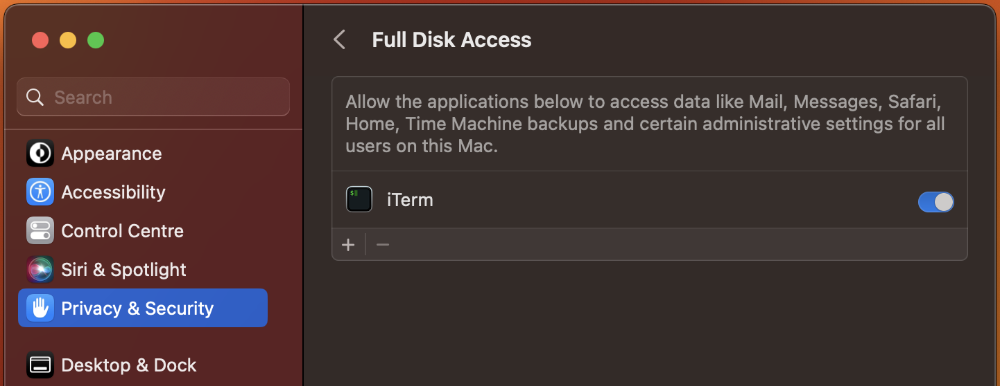

# ~/.deepraj 🖥️

Welcome to the backbone of my MacOS setup! This repository contains my personally curated dotfiles, optimised for MacOS. The setup is managed using [Dotbot](https://github.com/anishathalye/dotbot) and a custom `run` script, streamlining the process to set up a new system or to synchronise existing setups.

## Getting Started

### Prerequisites

- A MacOS system.
- A working internet connection.
- A terminal with Full Disk Access, necessary for writing MacOS defaults:
  - Navigate to `System Preferences -> Privacy & Security -> Full Disk Access`
  - Locate your current terminal in the list and check it, or click the `+` button to add your terminal application.
  - If the terminal application was open during this process, quit and restart it to ensure changes take effect.
  
- `git` installed. If you need to install Homebrew first, see lines 60-61 in `run.m4` for installation commands.

### The _Runner_

The `run` script is the centerpiece of this repository. It automates the setup and offers command-line arguments for the usual use-cases:

- `-i, --install`: Perform a fresh installation. This is the default behavior.
- `-u, --update`: Update the installed tools and applications.
- `-c, --configure-os`: Reconfigure the operating system settings.
- `-h, --help`: Print help.

## Installation

With the prerequisites in place, follow these steps to get the dotfiles up and running:

1. **Clone this repository**

   ```sh
   git clone https://github.com/DeeprajPandey/dotfiles.git ~/dotfiles
   cd ~/dotfiles
   ```

2. **Add execute permissions**

   ```sh
   chmod +x run
   ```

3. **Run the script**

   ```sh
   ./run
   ```

   By default, the script performs a fresh installation, sets up the environment, and applies MacOS configurations. Currently, this is equivalent to _running_ with the `-i` flag.

   ```sh
   ./run --install
   ```

   After the first run, there should be no need to run it in this mode again.

## Post Installation

1. Restart your device for changes to apply.
2. Open iTerm, go to `General -> Preferences` Change `Save changes` to **Automatically**.

   

## Gotchas

Keeping a friendly log of control flow assumptions. I will get around to refactoring these into more elegant solutions if I get some time. Until then, this section serves as the first place to check if something awry comes up during installation.

1. iTerm section of `macos.sh` sets a custom prefs path to `~/.config/iterm/Preferences`. Only, this directory will not be created until dotbot `install` script completes setting up symlinks to `~/.config`. If iTerm throws any errors, it's possible `run` was terminated before it could finish. Just rerun with `/.run -u` and it should work.

## Customisations

### Dotfile Modifications

Updating the dotfiles is straightforward. Edit any of the files and, to propagate modifications to the Brewfile and the rest of the dotfiles, run with the `-u` flag. This triggers a `brew upgrade`, reruns Dotbot to symlink the dotfiles, and executes any setup scripts to ensure your environment is correctly configured.

```sh
./run --update
```

For modifications to the `macos.sh` script, _run_ with the `-c` flag.

```sh
./run --configure-os
```

### `run` Modifications

I use [argbash](https://github.com/matejak/argbash) to generate the `run` script from an argbash template file `run.m4` included in this repository. If you need to update the main `run` script, follow these instructions:

1. [Install argbash](https://argbash.readthedocs.io/en/latest/install.html).

   > _Psst... if you have used my dotfiles, argbash is probably already set up as a Docker container. Run `argbash -h` to check. I use a shell function with fun argument modifications to invoke argbash system-wide - just to avoid keeping up with [individual releases](https://argbash.readthedocs.io/en/latest/install.html#user-installation) manually._

2. Make your changes to the `run.m4` file.

   > _Psst.. use [bash syntax highlighting](https://argbash.readthedocs.io/en/latest/guide.html#your-script) in your IDE._

3. Use argbash to generate the run script.

   ```sh
   argbash run.m4 -c -o run
   ```

   Omit the `-c` flag if you don't want to run argbash in commented mode.

4. [Optional] Add a pre-commit hook to generate the `run` script using argbash every time you update and commit a change to `run.m4`. Execute the following snippet from the root of this repo.

   ```sh
   # Check if .git/hooks/pre-commit already exists
   if [ -e .git/hooks/pre-commit ]; then
      # If it exists, append the contents of the new pre-commit hook to the existing one
      bat ./assets/git_hooks/pre-commit >> .git/hooks/pre-commit
   else
      # If it doesn't exist, copy the new pre-commit hook and set the execute permission
      cp ./assets/git_hooks/pre-commit .git/hooks/
      chmod +x .git/hooks/pre-commit
   fi
   ```

   > _Psst... if you have used my dotfiles, `bat` should be installed; otherwise, replace it with `cat`_
   >
   > Note: I use `ripgrep` in the pre-commit script. If you have modififed the brewfile and don't have ripgrep, change `rg "run.m4$"` to `grep "run.m4$"` on line 7 of the `./assets/git_hooks/pre-commit` file.

## Support & Contributions

If you run into issues or have any questions, please feel free to [open an issue](https://github.com/DeeprajPandey/dotfiles/issues).

While I'll strive to respond, do note that this is not an actively maintained project. These dotfiles represent configurations that are tailored to my preferences and may not suit everyone's needs.

Contributions are always welcome! Please create a pull request with your changes or improvements.

## License

This project is licensed under the GNU GPL v3.0 License. See the [LICENSE.md](LICENSE.md) file for details.
