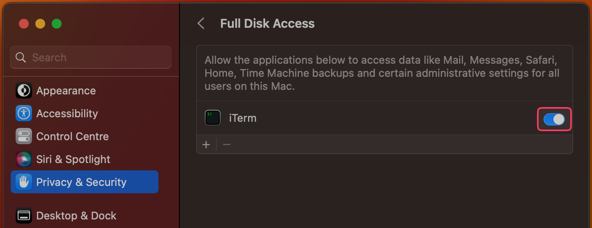

# ~/.deepraj 🖥️

This repository is my toolkit for setting up and managing my Mac. It handles the heavy lifting of configuring everything I need for a clean macOS environment. I use [Dotbot](https://github.com/anishathalye/dotbot) and a custom `run` script to keep everything in sync. Whether you're here to explore my setup or to look for ideas for your own dotfiles, feel free to dive in and make it your own.

## Getting Started

### Prerequisites

- **macOS system:** These dotfiles are specifically tailored for macOS.
- **Terminal with Full Disk Access:** For modifying macOS defaults, ensure your terminal has Full Disk Access.
  - Navigate to `System Preferences -> Privacy & Security -> Full Disk Access`.
  - Check your terminal application in the list, or add it if needed.
  - Restart your terminal for changes to take effect.
  
- **`git` installed:**  If you need to install Homebrew first, check `run.m4` (lines 60-61) for commands.

### The `run` Script

The `run` script is the core of this repository, offering automated setup and command-line arguments for various tasks:

- `-i, --install`: Perform a fresh installation (default).
- `-u, --update`: Update installed tools and applications.
- `-c, --configure-os`: Reconfigure operating system settings.
- `-h, --help`: Display help information.

## Installation

1. Clone the repository:

   ```sh
   git clone https://github.com/[USERNAME]/dotfiles.git ~/dotfiles
   cd ~/dotfiles
   ```

2. Add execute permissions:

   ```sh
   chmod +x run
   ```

3. Run the setup script:

   ```sh
   ./run
   ```

   This will perform a fresh installation, set up the environment, and apply macOS configurations.

## Post-Installation

1. **Restart your device** for changes to take effect.
2. **iTerm Settings:** Go to `General -> Preferences` in iTerm and change "Save changes" to **Automatically**.
   

3. **Shottr Settings:** Disable default screenshot keybindings in `System Preferences -> Keyboard -> Keyboard Shortcuts -> Screenshots` after your first run of Shottr.
   

## Gotchas

- **iTerm2 Configuration:**  The script configures iTerm2 with a custom preferences path (`~/.config/iterm/Preferences`) that's created later in the installation process. If iTerm2 encounters errors, rerun the script with `./run -u`.

## Customizations

### Dotfile Modifications

Update dotfiles with these steps:

1. Edit any file in the repository.
2. Run `./run --update` to propagate changes to the Brewfile, symlink dotfiles, and run setup scripts.

For modifications to `macos.sh`, run `./run --configure-os`.

### `run` Script Modifications

The `run` script is generated using [argbash](https://github.com/matejak/argbash) from the `run.m4` template.  To modify it:

1. Install argbash: [https://argbash.readthedocs.io/en/latest/install.html](https://argbash.readthedocs.io/en/latest/install.html). If dotfiles were set up using this `run` script, check if argbash is installed already as a docker container with `argbash -h`.
2. Edit the `run.m4` file (using bash syntax highlighting for better clarity).
3. Generate the `run` script:
   ```sh
   argbash run.m4 -c -o run
   ```
   (Omit `-c` to skip all comments in generated script.)

**Optional: Pre-commit Hook**

Automate script generation after `run.m4` changes using this snippet in the repository root:

```sh
if [ -e .git/hooks/pre-commit ]; then
  bat ./assets/git_hooks/pre-commit >> .git/hooks/pre-commit
else
  cp ./assets/git_hooks/pre-commit .git/hooks/
  chmod +x .git/hooks/pre-commit
fi
```

(If `bat` is not installed, replace it with `cat`. If you don't have ripgrep, replace `rg "run.m4$"` with `grep "run.m4$"` on line 7 of `./assets/git_hooks/pre-commit`.)


## Support & Contributions

For issues or questions, please feel free to [open an issue](https://github.com/DeeprajPandey/dotfiles/issues).

While I'll strive to respond, do note that this is not an actively maintained project. These dotfiles represent configurations that are tailored to my preferences and may not suit everyone's needs.

Contributions are always welcome! Feel free to create a pull request with your changes or improvements.

## License

This project is licensed under the GNU GPL v3.0 License. See the [LICENSE.md](LICENSE.md) file for details.
